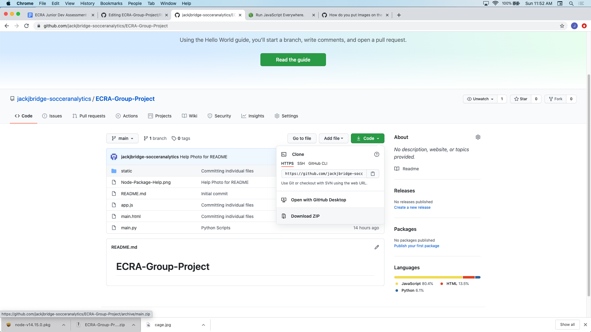

# ECRA-Group-Project

Step 1: Download the nodejs package from here: https://nodejs.org/en/download/. Make sure to select the correct package for your operating system. For example, I have a Mac so I click on this portion here: 

Step 2: Follow the instructions on the node installer to install the node packages. No special configurations will need to be made in the install process

Step 3: Download the repository as a zip:

Step 4: Move the zip file to the directory you'd like to place it, then unzip the zip file

Step 5: Once you have unzipped, open up the folder in the terminal (if Mac), or the command prompt(if Windows). For the Mac, that involves, right clicking on the folder, then selecting the option as shown below. For windows, you can also right click on the folder, then select "Open Command Window Here". To double check, once you have the prompt open type "ls" into the terminal/command and hit enter. You should see app.js along with the other files at the folder root in here.

Step 6: Run the following commands in the terminal/command to install the needed packages:

  npm install express  
  npm install express-session  
  npm install body-parser  
  npm install path  
  
Step 7: Once the correct packages are installed, run the command <strong>node app.js</strong>. This will start up the node server.

Step 8: While the server is running, go to http://localhost:8080/ to view the schools on the map
